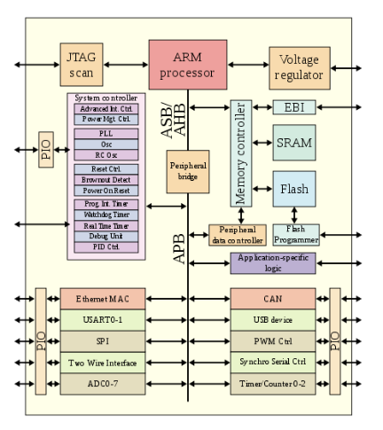

# ARM 프로세서
> ARM 프로세서는 RISC 기반의 중앙처리장치(CPU)이다.

* ARM(Advanced RISC Machine): 발전된 RISC 기계를 말한다.
* RISC(Reduced Instruction Set Computer): **CPU 명령어의 개수를 줄여 명령어 해석시간을 줄임으로써 개별 명령어의 실행속도를 빠르게** 한 컴퓨터다. CISC(Complex Instruction Set Computing)와 대조된다.
* Processor: 하드웨어적인 측면에서 '컴퓨터 내에서 프로그램을 수행하는 하드웨어 유닛'이다.

## ARM 프로세서 등장 배경
버클리 대학교에 한 프로그래머가 대부분의 프로그램이 명령어 세트의 작은 하위 집합만 사용한다는 사실을 알았다.

복잡하고 구현하기 어려우며 거의 사용되지 않는 명령어를 제거하여 미리 정의된 **명령어의 수**를 줄이면, 남은 간단한 명령어는 더 빠르게 실행될 수 있고 칩의 전력과 공간을 적게 차지하게 된다는 RISC 아키텍처를 내세웠다.

아콘은 마이크로컴퓨터에 쓸 만한 RISC 기반 CPU 아키텍처를 개발했고 이것이 ARM의 시작인 `Acorn RISC Machine`이다.

## ARM 아키텍처

- ARM 프로세서를 설계하는 디자인
- ARM Holdings는 칩 자체가 아닌 설계 구조를 판매
- 최적화는 개별 반도체 제조사에 따라 다르다.
- 명령 집합의 수가 적기 때문에 트렌지스터의 수가 적다.
    - 작은 크기, 낮은 전력 소비, 속도 및 배터리 수명과 비용의 균형을 맞출 수 있다.

## ARM 특징
- ARM 프로세서 탑재 기기에서는 ARM을 위해 개발된 프로그램만 실행 가능
- 하나의 ARM기기에 동작하는 OS는 다른 ARM 기반 기기에도 잘 작동한다.
- 오늘날 RISC와 CISC 자체의 속도는 큰 차이가 나지 않는다.
- ARM 아키텍처는 현재 거의 모든 스마트폰 설계외 소형 모바일 장치, 노트북 등에서 사용중