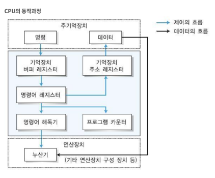

# CPU의 작동 원리
> 중앙처리장치(CPU)는 컴퓨터의 모든 시스템을 제어, 처리하는 가장 핵심적인 장치

> 다양한 입력 장치로부터 정보를 입력받아 처리한 후, 그 결과를 출력장치로 보내는 일련의 과정을 제어하고 조정하는 일을 수행

## CPU의 구성요소
### 1. 제어장치(Control Unit, CU)
컴퓨터 시스템의 작동을 통제하고 지시하는 장치
- (주)기억장치에서 프로그램 명령어를 꺼내 해독하고, 그 결과에 따라 필요한 제어 신호를 다른 장치들로 보낸다.

### 2. 연산장치(Arithmetic Logic Unit, ALU)
명령어를 실행하기 위한 산술, 논리 연산을 수행하는 장치
- 필요한 데이터를 레지스터에서 가져오고 결과를 레지스터에 다시 보낸다.

### 3. 레지스터(Register)
고속 임시 기억장치
- 메모리 계층의 최상위에 위치하며 가장 빠른 속도로 접근 가능한 메모리이다.
- 명령어 주소, 코드, 연산에 필요한 데이터, 연산 결과 등 저장한다.
- 범용 레지스터와 특수목적 레지스터가 있다. 아래는 특수 목적 레지스터다.
    - MAR (메모리 주소 레지스터) : 읽기와 쓰기 연산을 수행할 주기억장치 주소를 저장
    - PC (프로그램 카운터) : 다음에 실행될 명령어의 주소를 저장
    - IR (명령어 레지스터) : 명령어를 호출해서 해독하기 위해 현재 명령어의 정보를 임시로 저장
    - MBR (메모리 버퍼 레지스터) : 주기억장치의 내용을 임시로 저장하는 역할
    - AC (누산기) : 산술 논리 장치의 연산 결과를 임시로 저장
    - SP (스택 포인터) : 스택의 최상위 주소를 저장
    - IX (인덱스 레지스터) : 인덱스 주소 지정 방식에서 인덱스를 저장
    - PSR (프로그램 상태 레지스터) : CPU의 현재 상태 정보를 저장


#### 명령어 세트
CPU가 실행할 명령어의 집합

연산코드(실행할 연산: 연산, 제어, 데이터 전달, 입출력 기능) 
+
피연산자(필요한 데이터 or 저장위치: 주소, 숫자, 문자, 논리데이터..)

## CPU의 연산
1. Fetch(인출): 메모리상의 PC가 가리키는 명령어를 CPU로 인출하여 적재
2. Decode(해석): 명령어의 종류와 타켓 등을 해석하여 결정
3. Execute(실행): 해석된 명령어에 따라 데이터에 대한 연산 수행
4. Writeback(쓰기): 수행 완료된 데이터를 메모리에 기록

## CPU 동작과정

- 인출
1. `PC`가 다음에 수행할 명령어의 주소를 MAR으로 넘긴다.
2. MAR에 저장된 주소에서 명령어를 인출하여 MBR에 저장한다.
3. 다음 명령어 인출을 위해 PC의 값이 하나 증가한다.
4. MBR에 저장된 내용을 `IR`으로 전달한다.

```html
T0 : MAR ← PC
T1 : MBR ← M[MAR], PC ← PC+1
T2 : IR ← MBR
```

- 해석
1. `CU`가 `IR`에서 명령어를 해독하고 무슨 연산을 할지 결정한 후 연산장치에 넘긴다.

- 실행

    ex) ADD addr 이라는 명령어 연산

1. `ALU`가 연산을 실행한다.
AC(이미 누산기에 저장되어 있던 값)에 `MBR`(읽거나 쓸 데이터)을 더해주는 등의 연산을 수행한다.

+ MBR을 통해 데이터를 읽으면 명령어와 데이터(피연산내용)의 명확한 구분이 가능하며, IR은 주로 명령어를 저장하는 데에 전념할 수 있다.

- 쓰기
1. 주기억장치로 연산 결과를 전송한다.