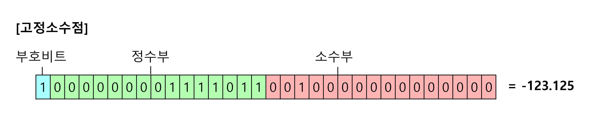
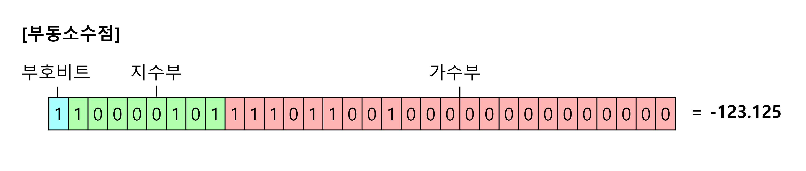
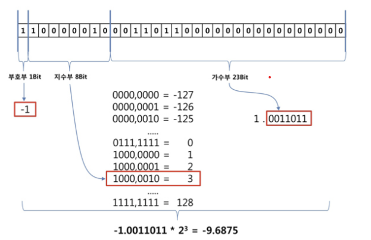

# 실수 표현
컴퓨터는 모든 정보를 2진수로 처리한다.
컴퓨터는 실수를 표현하기 위해 `고정소수점` 과 `부동 소수점` 방식을 사용한다.

## 고정소수점
```
소수점이 고정되어 있는 표현 방식
부호비트, 정수부, 소수부로 구성
```

- 부호비트: 0은 양수, 1은 음수
- **소수점의 위치를 중앙 고정**, 앞은 정수부 뒤는 소수부
- 123.125(10) == -1111011.001(2)가 고정된 소수점을 기준으로 들어가있는 형태
    - 장점: 단순
    - 단점: 표현의 범위가 작아서 활용하기 힘들다.

## 부동소수점
```
소수점이 유동적으로 표현되는 방식
부호비트, 지수부분, 가수부분으로 구성
```

- 부호비트: 0은 양수, 1은 음수
- 부동소수점은 실수를 **정규화**하여 지수부(소수점의 위치)와 가수부(실수의 실제값 표현)로 표현
    - 장점: 표현 가능한 수의 범위와 정밀도가 크다.
    - 단점: 복잡, 표현하고자 하는 수가 `1/2^x`의 합으로 나타낼 수 없으면 이진법에서 무한 소수가 되고 비트는 한정되어 있기 때문에 오차가 발생한다.

## 정규화
```
정수부가 1이 되도록 소수점을 옮기고
2^x를 곱하는 형태로 변환하여 표기하는 방법
```


- 그림 설명
    - -9.6875(10) -> -1001.1011(2) -> -1.0011011* 2^3
- 지수부: `2^x`에서 `x`+ `bias`값을 넣는다.
    - `32bit`: 지수부가 `8bit`라서 bias가 `127`이 된다.
    - `64bit`에서는 지수부가 `11bit`, 가수부가 `52bit`라 bias가 `1023`이 된다.
- 가수부: `소수점 아래의 값`들을 넣는다.