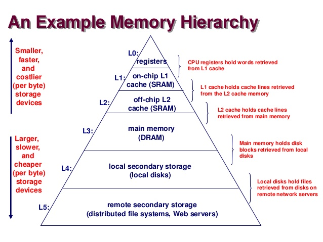
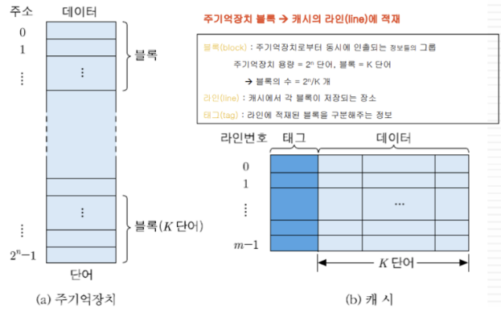
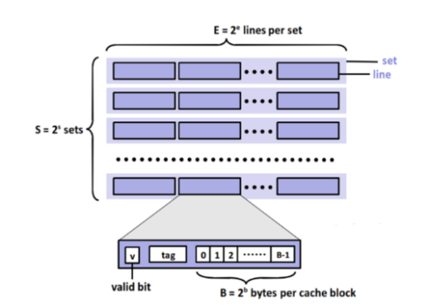
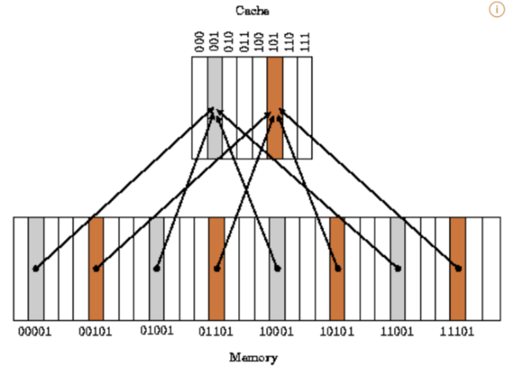
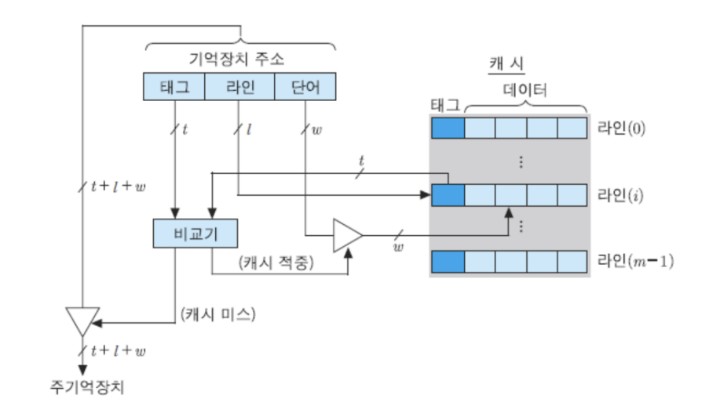
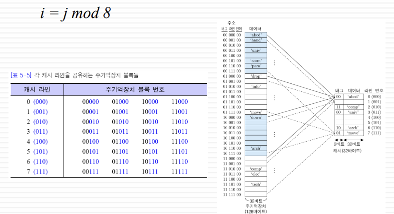

# 캐시 메모리
> 속도가 빠른 장치와 느린 장치에서 속도 차이에 따른 병목 현상을 줄이기 위한 메모리
```
ex1) CPU 코어와 메모리 사이의 병목 현상 완화
ex2) 웹 브라우저 캐시 파일은, 하드디스크와 웹페이지 사이의 병목 현상을 완화
```
## CPU 캐시 메모리란?



### 1. 특징
- CPU가 주기억장치에서 저장된 데이터를 읽어올 때, **자주 사용하는 데이터를 캐시 메모리에 저장**한 뒤, 다음부터는 캐시 메모리에서 먼저 가져오면서 속도를 향상시킨다.
- 속도는 빠르지만 용량이 작고 비용이 비싸다.
- CPU에는 이러한  캐시 메모리가 2~3개(속도와 크기가 젤 좋은 것부터 L1, L2, L3로 이름 붙여지고 L1부터 먼저 사용) 정도 사용된다.

### 2. 종류
- **듀얼 코어 프로세서의 캐시 메모리**: 각 코어마다 독립된 L1의 캐시 메모리를 가지고, 두 코어가 공유하는 L2 캐시 메모리가 내장된다.
    ```
    ex) L1캐시가 128kb이면 64씩 나눠 처리 전 명령어(Instruction-Cache)와 실행 후 명령어(Data-Cache)를 각각 저장한다.
    ```
    
- **L1** : CPU 내부에 존재
- **L2** : CPU와 RAM 사이에 존재
- **L3** : 보통 메인보드에 존재한다고 함
- **디스크 캐시**: 주기억장치(RAM)와 보조기억장치(HDD) 사이에 존재하는 캐시

→ 메모리 계층 구조에서 상위레이어는 하위레이어의 캐시 역할을 한다.

#### 😳 코어란 ?

- 말 그대로 CPU의 핵심요소이며 CPU 안에 있으면서 각종 **핵심적인 연산 처리**를 하는 단위를 의미한다. (ALU, CU 등을 포함하겠지?)

- CPU 그자체가 아니고 CPU 안에 있는 것으로 하나의 CPU 안에 여러 개의 코어가 있을 수도 있다.

- 각각의 코어는 독립적으로 명령어를 실행하고 데이터를 처리 가능

## 캐시 메모리 작동 원리
- **시간 지역성**: 반복문에 사용하는 조건 변수처럼 **한 번 참조된** 데이터는 잠시후 또 참조될 가능성이 높음
- **공간 지역성**: 연속 접근 시 참조된 데이터 **근처 데이터**가 또 사용될 가능성이 높음

- 따라서 캐시에 데이터를 저장할 때는, 이러한 참조 지역성들을 최대한 활용하기 위해 해당 데이터뿐만 아니라 **옆 주소의 데이터도 같이** 가져와 미래 대비

## 캐시 미스
```
CPU가 요청한 데이터가 있으면 'Cache Hit'
없어서 DRAM(RAM의 한 종류)에서 가져오면 'Cache Miss'
```
1. **Cold miss** : 해당 메모리 주소를 처음 불러서 나는 미스
2. **Conflict miss**: A, B가 같은 캐시 메모리 주소에 할당되어있어 나는 미스로 다른 공간이 비어 있어도 그 할당된 주소에 꼬옥 넣어야해서 원래 거를 쫓아냄 (주소 할당 문제, direct mapped cache에서 자주 발생)
3. **Capacity miss**: 캐시 메모리의 공간이 부족해서 나는 미스 (공간 문제)

→ 그렇다고 캐시 크기를 키워서 문제를 해결하면 접근 속도가 느려지고 파워를 많이 먹음

## 캐시 메모리의 구조 
- 작은 개념 -> 큰 개념순


1. 주기억장치에서 단어, 블록
- **단어**: 하나의 **주소 번지에 저장되는 데이터**의 단위
    - 단어의 길이는 사용되는 비트들의 수 or 명령어의 길이
    - 저 그림에서 단어당 주소가 1씩 증가하는데 일단 무시해봐.. 원래 블록당 주소가 1씩 증가하니까
- **블록**: 주기억장치에서 **동시에 인출되는 정보의 그룹**
    - 단어 or 바이트로 용량을 표현

2. 캐시 메모리에서 라인, 세트

- **라인**: 주기억장치에서의 **블록**이 저장되는 장소
    - 태그 비트, 유효 비트 ,데이터(캐시 블록이라 불리며 주기억장치에서 블록들이 담고 있는 단어들)를 저장 가능
- **세트**: 캐시 라인의 묶음(1~)
    - 세트의 번호가 캐시에서의 주소
- 캐시 메모리의 총 사이즈: S * E * B

## 캐시 메모리의 작동방식
```
주기억장치의 블록들이 어느 캐시 라인을 공유할 것인지 결정해주는 방법
```

1. **Directed mapped cache**(하나의 캐시 라인, E=1)
    
    가장 기본적인 구조로, DRAM의 **여러 주소(블록)들이 캐시 메모리의 한 주소(인덱스 필드)에 대응되는 다대일 방식**(실제로는 하나의 메모리 정보만 들어감)
    
    
    
    

    - 그림 설명

        주기억장치 주소는 태그필드 + **라인(인덱스) 필드** + 단어(데이터)필드로 구성
        - 같은 라인 필드를 가진 블록들은 같은 캐시 라인을 공유한다.
        - 라인 필드에 해당하는 숫자가 캐시 메모리의 주소의 라인 번호가 된다.

    - 특징
        - 각 캐시 라인은 2^t개의 블록들에 의해 공유
        - 같은 라인의 블록들은 서로 다른 태그(구분)를 가짐
        - 장점: 하드웨어가 간단하고 구현비용이 적게 든다
        - 단점: 적재될 캐시 라인이 하나 뿐이라 같은 라인을 공유하는 다른 블록이 적재되면 swap-out(conflict miss),
            
            캐시 공간이 효율적으로 사용되고 있지 않음

2. **Fully Associative cache**

    비어있는 캐시 메모리가 있으면, 마음대로 주소를 저장
    
    - 간단하지만 조건이나 규칙이 없어 찾을 때 힘들다….
    
    - CAM이라는 특수한 메모리 구조를 사용해야는데 가격이 비쌈
    
3. **Set Associative Cache**
    
    Direct + Fully 방식
    
    - 특정 행(set)을 정하고 그 행 안에 어떤 열(line)이든 비어있을 때 저장