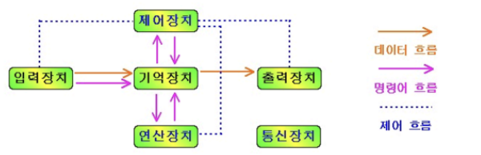
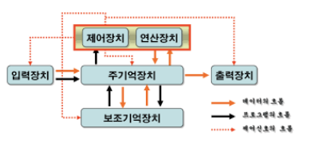
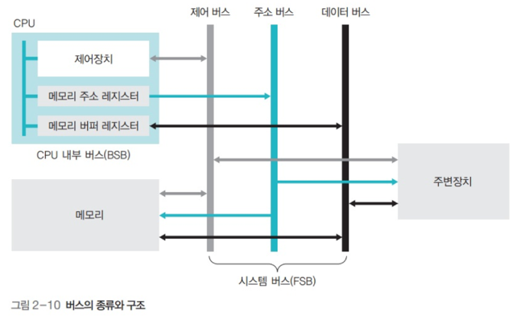
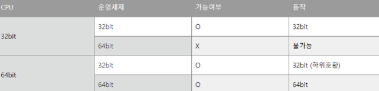

# 컴퓨터의 구성

> 읽기 -> 처리하기 -> 저장하기

## 하드웨어
> 컴퓨터를 구성하는 기계적 장치(물리적)

### 5가지 구성요소 장치

1. 입력장치: 데이터 to 컴퓨터 내부 (키보드)

2. 출력장치: 데이터 가공.처리해 생성된 정보 표시(모니터)

3. 제어장치: 장치들의 동작과 데이터 흐름 제어

4. 연산장치: CPU의 기능 보충하는 보조프로세서

5. 기억장치: 프로그램이 처리한 정보 저장

### 중앙처리장치, 주기억장치, 보조기억장치

1. 중앙처리장치(CPU): 컴퓨터의 모든 작동 과정을 제어
    - 산술연산장치(ALU): 연산, 데이터상태(Flag)표시
    - 제어장치(CU): CPU 내부 작업들 **통제관리**, 명령어 **해독** 및 해당 장치에 **제어 신호 전달**
    - 레지스터: **소규모의 고속 기억 장치**
        - CPU 내에서 데이터 임시 보관

2. 주기억장치(메모리)
    - 특징
      - **실행되는** 프로그램 저장
      - 내부 기억장치
      - 컴퓨터 시스템에서 수행되는 프로그램과 수행에 필요한데이터를 기억
      - RAM(휘발), ROM(비휘발, 읽기 전용)
    - 장점
      -  CPU에 접근하는 속도가 빠름
    - 단점
      - 가격이 비싸 저장 용량 작음
    - 명령어와 데이터를 저장하는데 컴퓨터는 이진수로 저장하니까 겉보기로는 모든 것이 데이터를 저장한 것처럼 보임 

3. 보조기억장치
    - 특징
      - **보관할** 프로그램 저장
      - 외부 기억장치
      - **비휘발성(반영구적)**
      - CPU와 직접 정보 교환 불가 -> 주기억장치로 옮겨진 후에 처리
    - 장점
        - 저렴
        - 큰 저장 용량
    - 단점
        - 느린 속도로 CPU와 직접 정보 교환 불가
    - HDD, SSD

### BUS
> 컴퓨터 구성 장치들 간의 통신 시스템

> 하드웨어 구성요소를 물리적으로 연결하는 선

1. 데이터 버스: CPU와 기타 장치 사이에서 데이터(주소 안에 있는 값)를 전달하는 통로
   - 기억장치와 입출력 장치의 명령어 -> CPU
   - CPU의 연산결과 -> 기억장치 or 입출력 장치
   - **양방향**
  
2. 주소 버스: CPU가 주기억장치나 입출력장치로 읽거나 쓸 주소(데이터의 위치 정보)를 전달하는 통로
   - CPU가 주소 -> 주기억장치 or 입출력 장치
   - **단방향** 
  
3. 제어 버스: 제어 신호를 전달하는 통로
   - 기억장치 읽기 및 쓰기
   - 버스 요청 및 승인
   - **양방향**
  
+) 버스 대역폭: 한 번에 전달할 수 있는 최대 데이터의 크기
  
### CPU와 OS의 기본 데이터 처리 단위란 ?
> 한번에 처리할 수 있는 데이터의 크기

> 32bit, 64bit 컴퓨터 ~ 이런 용어가 여기에 해당

1. 기본 용어
    - 프로세스: 메모리에 적재되어 있는 프로세서에 의해 실행 중인 프로그램
    - 프로세서: 프로그램 명령을 수행하기 위한 논리회로
    - CPU는 하드웨어적 측면으로는 **중앙처리장치**, 소프트웨어적 측면에서는 데이터 포맷을 변환하는 역할을 수행하는 **프로세서** 

2. 그럼 32비트 64비트 이런 건 뭐야?
    - 00비트 머신(CPU)라고 하면 그 머신의 **기본 데이터 처리 단위**(워드 사이즈)가 00비트에 해당되는 것이다.
    - 주소 레지스터의 최대 처리값이 n-bit인 컴퓨터
    - 운영체제에도 기본 데이터 처리 단위가 있다.

-> 조합에 따라 어떤 모드(bit)로 동작하는지 결정

## 소프트웨어
> 하드웨어의 동작을 지시하고 제어하는 명령어의 집합

- 시스템 소프트웨어: 운영체제, 컴파일러
- 응용 소프트웨어: 워드프로세서, 스프레드시트