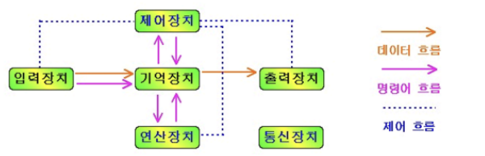
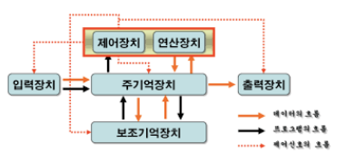

# 컴퓨터의 구성

> 읽기 -> 처리하기 -> 저장하기

## 하드웨어
> 컴퓨터를 구성하는 기계적 장치(물리적)

#### - 5가지 구성요소 장치

1. 입력장치: 데이터 to 컴퓨터 내부 (키보드)

2. 출력장치: 데이터 가공.처리해 생성된 정보 표시(모니터)

3. 제어장치: 장치들의 동작과 데이터 흐름 제어

4. 연산장치: CPU의 기능 보충하는 보조프로세서

5. 기억장치: 프로그램이 처리한 정보 저장(ROM)

#### - 중앙처리장치, 주기억장치, 보조기억장치

1. 중앙처리장치(CPU): 컴퓨터의 모든 작동 과정을 제어
    - 산술연산장치(ALU): 연산, 데이터상태(Flag)표시
    - 제어장치(CU): CPU 내부 작업들 **통제관리**, 명령어 **해독** 및 해당 장치에 **제어 신호 전달**
    - 레지스터: **소규모의 고속 기억 장치**
        -  CPU 내에서 데이터 임시 보관
        - 범용 레지스터와 특수 목적 레지스터로 구성
            - 특수 목적 레지스터
                - MAR (메모리 주소 레지스터) : 읽기와 쓰기 연산을 수행할 주기억장치 주소를 저장
                - PC (프로그램 카운터) : 다음에 실행될 명령어의 주소를 저장
                - SP (스택 포인터) : 스택의 최상위 주소를 저장
                - IX (인덱스 레지스터) : 인덱스 주소 지정 방식에서 인덱스를 저장
                - IR (명령어 레지스터) : 명령어를 호출해서 해독하기 위해 현재 명령어를 임시로 저장
                - MBR (메모리 버퍼 레지스터) : 주기억장치의 내용을 임시로 저장하는 역할
                - AC (누산기) : 산술 논리 장치의 연산 결과를 임시로 저장
                - PSR (프로그램 상태 레지스터) : CPU의 현재 상태 정보를 저장

2. 주기억장치
    - 특징
        - 내부 기억장치
        - 컴퓨터 시스템에서 수행되는 프로그램과 수행에 필요한 데이터를 기억
        - CPU에 접근하는 속도가 빠름
        - ROM(비휘발), RAM(휘발)

3. 보조기억장치
    - 특징
        - 외부 기억장치
        - **비휘발성(반영구적)**
        - CPU와 직접 정보 교환 불가 -> 주기억장치로 옮겨진 후에 처리
    - 장점
        - 저렴
        - 큰 저장 용량
    - 단점
        - 느린 속도로 CPU와 직접 정보 교환 불가
    - HDD, SSD

#### BUS

## 소프트웨어