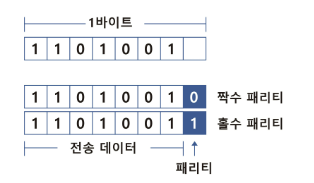
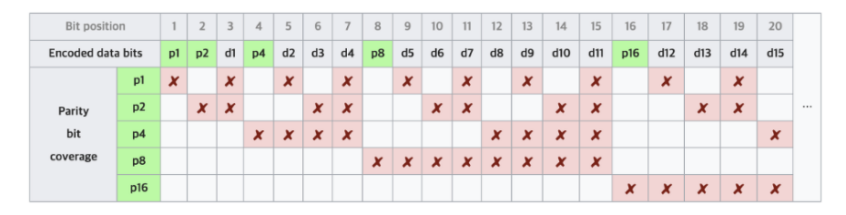

# 패리티 비트 & 해밍 코드
> 정보의 전달 과정에서 오류가 생기는 것을 검사하고 수정하기 위해 패리티 비트와 해밍 코드를 사용한다.

## 패리티 비트
```
정보 전달 과정에서 오류가 생겼는지 검사하기 위해 추가된 비트
```
- 1Byte(8bit) 데이터에서 7bit 크기의 ASCII 코드를 제외한 나머지 1bit가 패리티(Parity) 비트이다.
- 패리티비트를 포함하여 1의 개수가 짝수나 홀수개가 되도록 하여 오류를 검출한다.


- 짝수 패리티
    - 1의 개수를 짝수로 맞춘다.
    - 1101001의 데이터는 1의 개수가 4개(짝수) 이므로, 짝수 패리티 비트는 0이 된다.
    -> 11010010

- 홀수 패리티
    - 1의 개수를 홀수로 맞춘다.
    - 1101001의 데이터는 1의 개수가 4개(짝수) 이므로, 홀수 패리티 비트는 1이 된다.
    -> 11010011

- 특징
    - 짝수 홀수 개수로만 검증하므로 2개의 bit, 짝수개의 데이터가 손실되면 검출할 수 없다.
    - 오류 검출만 하며 수정하지는 않는다.

## 해밍 코드
```
데이터 전송시 1비트의 오류를 검출하고 수정할 수 있는 코드
```

- 8bit 기준으로 `2의 n승 번째 자리`부터  `n개의 간격`으로 `n개씩` bit를 확인하며 패리티 비트를 결정한다.

- 해밍코드를 통한 오류 검출 및 수정
    - 해당 자리의 비트를 확인하며 **패리티비트가 맞는지** 체크한다.
    - 패리티비트가 올바르면 0, 틀리면 1을 **기록**하고 이것의 **역순**을 **10진법**으로 바꾸면 오류가 있는 비트의 위치를 알 수 있다.

- 오류 수정 예시
짝수 패리티의 해밍 코드가 0010011일때 오류 수정 예시

    - p1(1, 3, 5, 7번째 비트 확인): 1이 짝수개로 패리티비트 0이 맞다. 0
    - p2(2, 3, 6, 7번째 비트 확인): 1이 홀수개로 패리티비트가 1이어야하는데 0이다. 1
    - p4(4, 5, 6, 7번째 비트 확인): 1이 홀수개로 패리티비트 1이 맞다. 0

    - 역순으로 나온 수 010을 10진법으로 바꾸면 2이므로 두 번째 비트를 수정하면 된다.

    - 최종적으로 수정한 데이터는 0110011 이다.

- 특징
    - 짝수개의 데이터가 손실되면 검출할 수 없다.
    - 비트의 에러가 서로 상쇄되어 1의 개수가 그대로임 -> 패리티 비트가 변하지 않음