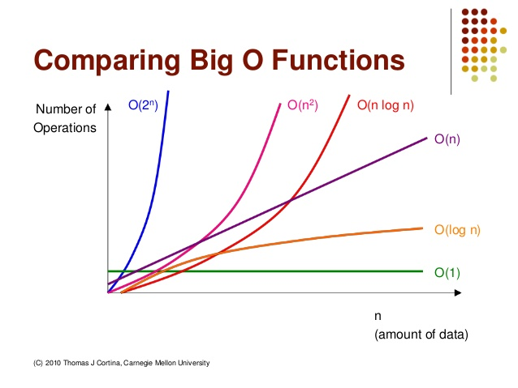
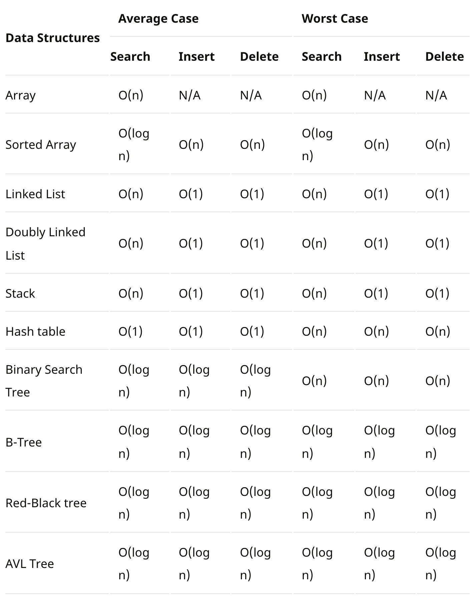

# 복잡도

> 자료구조는 효율적으로 데이터를 관리하고 수정, 삭제, 탐색, 저장할 수 있는 데이터 집합

> 복잡도는 시간 복잡도와 공간 복잡도로 나뉜다

## 시간 복잡도
- **시간 복잡도**란 문제를 해결하는 데 걸리는 시간과 입력의 함수 관계
- 효율적인 코드로 개선하는 데 쓰이는 척도가 된다.

## 빅오 표기법

- **빅오 표기법**이란 입력 범위 n을 기준으로 로직이 몇 번 반복되는지 나타내는 것
    - **가장 영향을 많이 끼치는** 항의 상수 인자를 빼고 나머지 항을 없앤 것
    - 입력 크기가 커질수록 연산량이 가장 많이 커지는 항만 따진다.

## 공간 복잡도
- **공간 복잡도**는 프로그램을 실행시켰을 때 필요로 하는 자원 공간의 양

## 자료구조에서 시간 복잡도

- 접근 : 주어진 인덱스 접근 (배열과 해시테이블에서 상수 시간 가짐)
- 탐색 : 주어진 요소가 어느 인덱스에 있는지 탐색 (인덱스 정보 모른다고 가정, 배열에도 정보가 없으면 별 소용 없음)
- 배열의 삽입과 삭제는 보통 O(n)
- 평균과 최악의 시간 복잡도를 비교하며 살펴볼 땐, 이진 탐색 트리와 해시 테이블을 주의 깊게 살피기