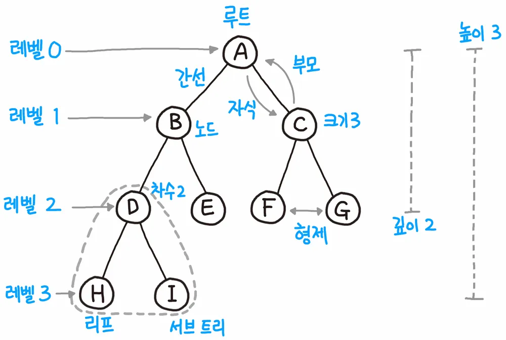
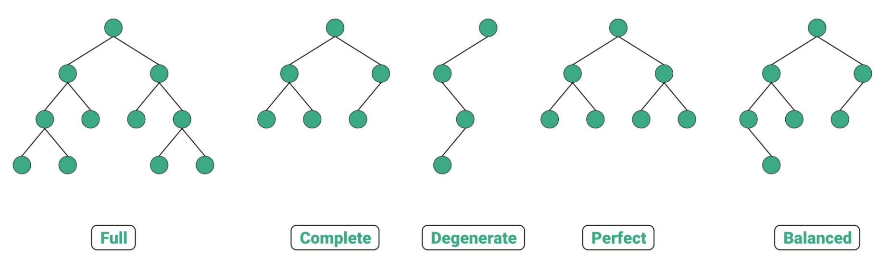

# 비선형 자료 구조
> 비선형 자료 구조란 일렬로 나열하지 않고 자료 순서나 관계가 복잡한! 구조

## 그래프
- 어떠한 곳에서 어떠한 곳으로 무언가를 통해 이동
- **정점**(어떠한 곳)과 **간선**(무언가)으로 이뤄진 자료구조
- 정점과 간선으로 이뤄진 집합

- 용어
    - 단방향 간선, 양방향 간선
    - 나가는 간선: outdegree
    - 들어오는 간선: indegree
    - 정점: V
    - 간선: U
    - 가중치: 간선과 정점 사이에 드는 비용

## 트리

- **트리**는 그래프 중 하나로 정점과 간선으로 이뤄져 있고, 트리 구조로 배열된 일종의 계층적 데이터 집합

- 특징
    - V(노드 수) - 1 = E(간선 수)
    - 임의의 두 노드 사이의 경로를 유일무이하다.

- 구성
    - 루트노드: 가장 위에 있는 노드
    - 내부노드: 루트와 리프노드 사이에 있는 노드
    - 리프노드: 자식노드가 없는 노드
    
    - **높이**: 루트 ~ 리프까지 거리 중 가장 긴 거리
    - **깊이, 레벨**: 각 노드마다 다르며, 루트 ~ 특정 노드까지의 최단거리
    - 서브트리: 트리 내 하위 집합, 하나 이상의 자식노드를 가지면 됨

### 이진 트리
- 이진 트리는 자식의 노드 수가 **2개 이하**인 트리


- 정이진트리: 자식노드가 **0 or 2개**
- 완전 이진 트리: 왼쪽부터 채워져 있는 이진 트리, 마지막 레벨을 제외하고는 모든 레벨이 완전히 채워져 있다.
- 변질 이진 트리: 자식노드가 **1개**
- 포화 이진 트리: 모든 노드가 **꽉 차** 있는
- 균형 이진 트리: 왼쪽과 오른쪽 노드의 **높이 차이가 1 이하**

### 이진 탐색! 트리
- 이진 탐색 트리는 노드의 오른쪽 하위 트리에는 '노드 값보다 큰 값'의 노드만, 왼쪽 하위 노드에는 '노드 값보다 작은 값'이 들어 있는 트리

- 하위 트리들도 같은 특성을 지녀 검색에 용이

- 보통 O(log n)이 걸리고 최악의 경우 O(n)(삽입순서에 따라 선형적일수도..)이 걸린다.

#### AVL트리
- 선형적 트리가 되는 것을 방지하기 위해 트리 일부를 **회전하며 스스로 균형**을 잡는 이진 탐색 트리
- 두 자식 서브트리의 높이는 항상 최대 1만큼 차이가 난다.
- 탐색, 삽입, 삭제 모두 O(logn)의 시간 복잡도를 가진다.

#### 레드 블랙 트리
- **레드 or 블랙의 추가 비트를 저장하며 스스로 균형을 유지**하는 이진 탐색 트리
- 모든 리프 노드와 루트 노드는 블랙!
어떤 노드가 레드이면 그 노드의 자식은 블랙!

### 힙
- **완전 이진 트리**기반의 자료 구조
- 최대힙: **루트 노드**에 있는 키는 모든 자식에 있는 키 중에서 **가장 커야** 한다.
- 최소힙: **루트 노드**에 있는 키는 모든 자식에 있는 키 중에서 **최솟값**이어야 한다.

1. 최대힙의 삽입
    - 새로운 노드를 힙의 마지막에 이어서 삽입
    - 이 새로운 노드를 부모 노드들!과 크기를 비교하며 교환

2. 최대힙의 삭제
    - 루트 노드를 삭제
    - 마지막 노드와 루트 노드를 스왑
    - 자식 노드들!과 크기를 비교하며 교환

#### 우선순위 큐
- 우선순위 대기열
- 우선순위가 높은 요소를 front에 넣어 순위가 낮은 요소보다 먼저 제공
- 힙 기반
```
#include <bits/stdc++.h>
using namespace std;
priority_queue<int, vector<int>, greater<int> > pq; //오름차순
//priority_queue<int, vector<int>, less<int> > pq; // 내림차순
int main(){
    // 오름차순에 따라 정렬 삽입됨
    pq.push(5);
    pq.push(4);
    pq.push(3);
    pq.push(2);
    pq.push(1);
    // 맨 앞에 있는 요소 반환
    cout << pq.top() << "\n";
    return 0;
}
/*
1 
*/
```

#### 맵
- 특정 순서에 따라 키와 매핑된 값의 조합으로 형성된 자료 구조
- **레드 블랙 트리 자료 구조 기반으로 형성**
- 삽입시 key기준 오름차순으로 자동 정렬해주는 map과 정렬을 보장하지 않는 unordered_map이 있다.
- 해시 테이블 구현시 사용
```
#include <bits/stdc++.h>
using namespace std;
int v[10];
int main(){
    unordered_map<string, int> umap; 
    
    umap["test1"] = 4;
    umap["test2"] = 10;

    // 키의 순서를 보장하지 않아서... 실행할때마다 다르게 나타날 수 있다.
    for(auto element : umap){
        cout << element.first << " :: " << element.second << '\n';
    }  
    cout << umap["test1"] << "\n";  
    return 0;
}
/*
test5 :: 5
test1 :: 4
not found..
5
2
1
*/
```

```
#include <bits/stdc++.h>
using namespace std;
int main(){
    map<string, int> _map;
    // 특별한 초기화 없이도 맵은 키를 처음 사용할 때
    // 해당 타입의 기본값으로 초기화 해줌
    _map["큰돌"]++;
    _map["큰돌"]++;
    for(auto c : _map){
        cout << c.first << " : " << c.second <<"\n";
    }
    return 0;
}
/*
큰돌 : 2
*/
```

#### 셋
- 특정 순서(해시함수 말하는 건가)에 따라 고유한 요소를 저장하는 컨테이너
- 중복되는 요소는 없고 오로지 희소한 값만 저장

#### 해시 테이블
- 무한에 가까운 테이블들을 유한한 개수의 해시 값으로 매핑한 테이블
- 삽입.삭제.탐색 시 평균적으로 O(n)
- unordered_map으로 구현