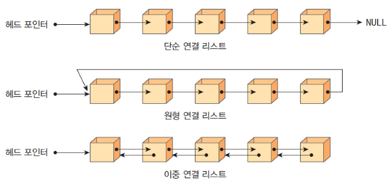

# 선형 자료 구조
> 선형 자료 구조란 요소가 일렬로 나열되어 있는 자료 구조를 말한다.

## 연결 리스트

- **연결 리스트**는 데이터를 감싼 노드를 포인터로 연결해서 공간적인 효율성을 극대화 시킨 자료구조

- 삽입과 삭제에는 **O(1)**(선을 바꿔서 연결하기만 하면 됨), 탐색에는 **O(n)**이 걸린다.

- next 포인터만 가지는 싱글 연결 리스트, next 포인터와 prev 포인터를 가지는 **이중 연결 리스트**, 그리고 이중 연결 리스트에서 마지막 노드의 next 포인터가 헤드 노드를 가리키는 원형 이중 연결 리스트가 있다.

```
#include <bits/stdc++.h>
using namespace std; 
int main(){
    // int형 요소를 담는 list a 선언
     list<int> a; 

    // 뒤에서부터 요소를 넣는 push_back(), 넣은 순서대로 들어간다고 생각
     for(int i = 0; i < 10; i++)a.push_back(i);

    // 앞에서부터 요소를 넣는 push_front()
     for(int i = 0; i < 10; i++)a.push_front(i); 
    
    // 반복자가 리스트의 맨 앞을 가리킴
     auto it = a.begin(); it++;
    
    // 중간에 요소를 넣는 insert()
     a.insert(it, 1000);
    
     for(auto it : a) cout << it << " ";
     cout << '\n';

    // pop(): 삭제
     a.pop_front();
     a.pop_back();
    
     for(auto it : a) cout << it << " ";
     cout << '\n';  

    return 0;
}
/* 
9 1000 8 7 6 5 4 3 2 1 0 0 1 2 3 4 5 6 7 8 9
1000 8 7 6 5 4 3 2 1 0 0 1 2 3 4 5 6 7 8
*/
```

## 배열
- **배열**은 같은 타입의 변수들로 이뤄져 있고, 크기가 정해져 있으며, 인접한 메모리 위치에 있는 데이터를 모아놓은 집합

- 중복 허용, 순서 있음

- 접근에 **O(1)**, 삽입과 삭제에는 **O(n)**이 걸린다(모든 데이터를 옮기는 작업).

```
#include <bits/stdc++.h>
using namespace std; 
// int형 데이터를 가지는 배열 a 선언
int a[10];
int main(){   
     for(int i = 0; i < 10; i++)a[i] = i; 
     for(auto it : a) cout << it << " ";
     cout << '\n'; 
    return 0;
}
/* 
0 1 2 3 4 5 6 7 8 9 
*/
```

### 랜덤 접근과 순차적 접근
- 랜덤 접근은 동일한 시간에 순차적인 데이터가 있을 때 임의의 인덱스에 해당하는 데이터에 접근 가능한 기능 (배열)
- 순차적 접근은 데이터를 저장한 순서대로 검색해야한다. (연결 리스트)

## 벡터
- **벡터**는 동적으로 요소를 할당할 수 있는 동적 배열

- 접근과 **맨 뒤**의 요소 삽입.삭제에 **O(1)**이 걸리고, 맨 뒤가 아닌 요소를 삽입.삭제하는데에는 **O(n)**이 걸린다.

- push_back()은 O(1)의 시간 복잡도를 가진다.
    - 2의 제곱승 +1 마다 크기를 2배씩 늘림
    - c를 i번째 push_back() 할 때 드는 비용: 1 or 1 + 2^k
    - n번 push_back()을 할 때 드는 비용은 3n - 1
    -> 상수시간에 가까운 amortized 복잡도를 가진다.

```
#include <bits/stdc++.h>
using namespace std;
// 벡터 선언
vector<int> v;
int main(){
    // 뒤에 요소 삽입
    for(int i = 1; i <= 10; i++)v.push_back(i);
    for(int a : v) cout << a << " ";
    cout << "\n";
    // 뒤 요소 삭제
    v.pop_back();

    for(int a : v) cout << a << " ";
    cout << "\n";

    // 0번째 인덱스의 값을 없애요
    v.erase(v.begin(), v.begin() + 1);

    for(int a : v) cout << a << " ";
    cout << "\n";

    auto a = find(v.begin(), v.end(), 100);
    if(a == v.end()) cout << "not found" << "\n";

    // 벡터는 동적이니까 알아서 끝을 바꿔줌, 지금 v.end()는 7번째 인덱스를 가리킴, 10으로 초기화
    fill(v.begin(), v.end(), 10);
    for(int a : v) cout << a << " ";
    cout << "\n";
    v.clear();
    for(int a : v) cout << a << " ";
    cout << "\n";

    return 0;
}
/*
1 2 3 4 5 6 7 8 9 10
1 2 3 4 5 6 7 8 9
2 3 4 5 6 7 8 9
not found
10 10 10 10 10 10 10 10
*/
```

## 스택
- **스택**이란 가장 마지막에 들어간 데이터가 가장 첫 번째로 나오는 성질(LIFO)을 가진 자료 구조이다.
- 책장에 쌓여있는 책!
- 재귀적인 함수, 알고리즘, 웹 브라우저 방문 기록
- 삽입과 삭제에 **O(1)**(항상 top - 가장 최신 삽입된 것에서만 가능하므로), 탐색에 **O(n)**이 걸린다.
```
#include<bits/stdc++.h> 
using namespace std;  
// int형 데이터 저장하는 stack 변수 stk 선언
stack<int> stk; 
int main() {
    ios_base::sync_with_stdio(false);
    cin.tie(NULL);
    // 맨 뒤(최신)에 삽입
    for(int i = 0; i < 10; i++)stk.push(i);  
    while(stk.size()){
        // 맨 뒤의 값 리턴
        cout << stk.top() << " ";
        // top에 있는 데이터 삭제, 리턴이 없기 때문에 필요시 top으로 먼저 받아오기
        stk.pop();
    } 
}
/* 
9 8 7 6 5 4 3 2 1 0
*/
```

## 큐
- **큐**는 먼저 집어 넣은 데이터가 먼저 나오는 성질(FIFO)를 지닌 자료 구조이며, 스택과 반대되는 개념
- 대기줄이라고 생각
- 작업을 기다리는 프로세스, 스레드 행렬, 네트워크 접속을 기다리는 행렬, 너비 우선 탐색, 캐시 등
- 삽입과 삭제에 **O(1)**(삽입은 back(최신)에 삭제는 front(먼저)에), 탐색에 **O(n)**이 걸린다.
```
#include <bits/stdc++.h>
using namespace std;
int main(){
    queue<int> q;
    // 맨 뒤에 삽입
    for(int i = 0; i < 10; i++)q.push(i);
    while(q.size()){
        cout << q.front() << " "; 
        // 맨 앞 요소 삭제(만) 
        q.pop();
    }  
    return 0;
}
/* 
0 1 2 3 4 5 6 7 8 9
*/
```